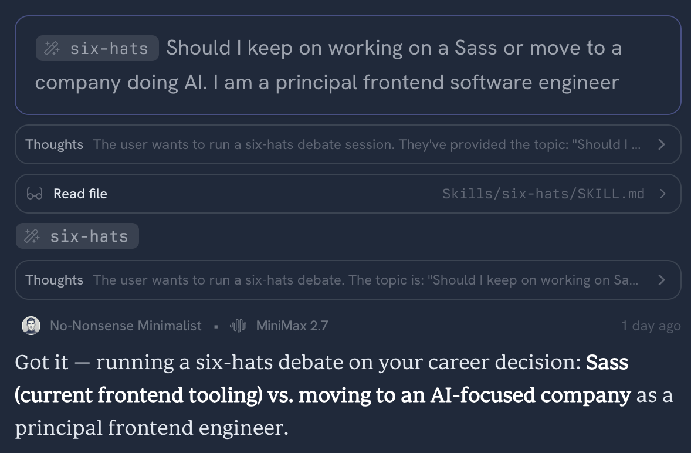
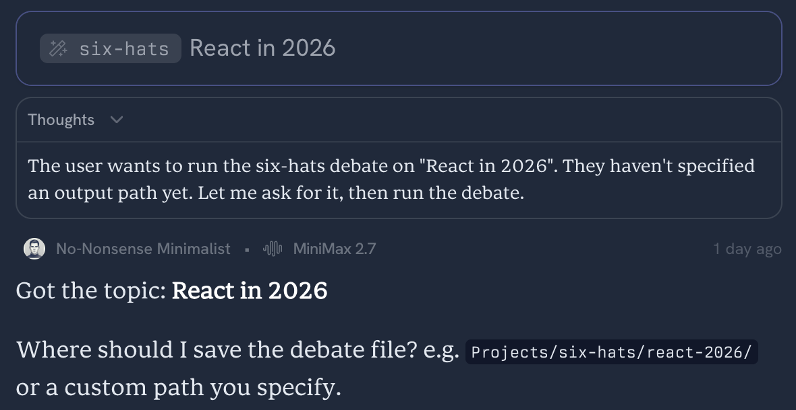

# Six Hats Skill

A structured decision-debate skill for running Edward de Bono-style six hats sessions with an AI agent. It walks a topic through facts, intuition, upside, risk, alternatives, and final moderation so you get a practical recommendation instead of a loose brainstorm.

## What It Does

The skill runs three sequential rounds using these roles:

- **White Hat**: facts, known information, and unknowns
- **Red Hat**: intuition, emotional reactions, and gut checks
- **Yellow Hat**: benefits, upside, and reasons the idea could work
- **Black Hat**: risks, objections, failure modes, and downsides
- **Green Hat**: alternatives, reframes, and creative options
- **Blue Hat**: moderation, synthesis, final recommendation, agreements, tensions, and next steps

The hats run in order so each perspective can build on the previous ones. Blue Hat moderates and synthesizes rather than contributing a normal debate statement during each round.

## When To Use It

Use this skill when you want to pressure-test a decision, strategy, plan, architecture choice, product direction, or career move. It works best when the prompt is framed as a concrete decision or question.

Example prompts:

```text
Run a six hats debate on whether we should migrate this app from REST to GraphQL.
Write the output to ./decisions.
```

```text
Use six hats to evaluate whether I should keep working on frontend tooling or move to an AI company.
Save it in ./examples.
```

## Examples

Below are completed debates plus screenshots of typical agent conversations when using this skill.

### Career decision — frontend tooling vs. AI companies

Pressure-tests staying in frontend tooling versus moving toward an AI company: tradeoffs, risks, and synthesis.

**Summary:** A principal frontend engineer debates staying deep in Sass and CSS tooling versus joining the AI boom. White and Yellow underline strong demand for senior UI talent and upside in AI interfaces; Black warns about hype, startup churn, narrower “dashboard + chat” work, and interview pressure to prove AI literacy. Green breaks the binary (AI + frontend infra vendors, internal AI projects, positioning at the intersection). Red names fatigue with the old lane versus fear of chasing shiny objects. Across three rounds, Blue Hat lands on phased optionality—not an immediate pivot: ship a small AI-powered UI experiment to see how it feels, run a few exploratory interviews for real compensation and role data, talk openly with your current employer about AI-adjacent growth, then judge any offer on team, product, and day-to-day frontend work rather than the “AI company” label alone.

[](examples/six-hats-career-advice.md)

**Full markdown debate:** [`examples/six-hats-career-advice.md`](examples/six-hats-career-advice.md)

### Technology direction — React in 2026

Explores React’s role, ecosystem tradeoffs, and strategic framing for frontend work in 2026.

**Summary:** The debate weighs React’s institutional advantages—talent pool, npm ecosystem, React 19, compiler maturity, RSC-driven bundle wins in content-heavy apps—against shared unease: a harder mental model, Next.js/Vercel coupling and roadmap risk, perceived migration churn, and how much benchmark gaps vs. fine-grained frameworks translate to users. Green repeatedly widens the frame (Rust compile-to-native options, server-first/live views, AI-written UI changing cost and mental models). Blue Hat’s recommendation is defensive maturity: React is still a reasonable default for many teams, but treat the stack as leverage you manage, not dogma—keep server/client boundaries explicit, avoid unnecessary vendor lock-in, instrument real performance, and stay mobile enough that ecosystem shifts do not trap you.

[](examples/six-hats-react-2026.md)

**Full markdown debate:** [`examples/six-hats-react-2026.md`](examples/six-hats-react-2026.md)

## Installation

Clone this repository into the skills directory used by your agent runtime.

For Claude-style skills:

```bash
git clone https://github.com/juanallo/six-hats-skill ~/.claude/skills/six-hats
```

For agent skills loaded from `~/.agents/skills`:

```bash
git clone https://github.com/juanallo/six-hats-skill ~/.agents/skills/six-hats
```

For Cursor personal skills, use Cursor's personal skill directory:

```bash
git clone https://github.com/juanallo/six-hats-skill ~/.cursor/skills/six-hats
```

If you already cloned the repository somewhere else, copy or symlink the whole directory so `SKILL.md` lives directly inside the final `six-hats` folder:

```bash
ln -s /path/to/six-hats-skill ~/.claude/skills/six-hats
```

The important directory shape is:

```text
six-hats/
|-- SKILL.md
|-- README.md
|-- examples/
`-- scripts/
```

## Usage

After installation, ask your agent for a "six hats" or "six hats debate" session. Include:

1. The decision, plan, or question to debate.
2. The output directory where the generated debate should be written.

The skill writes a markdown file named like:

```text
debate-YYYYMMDD_HHMMSS.md
```

The generated file contains:

- Final recommendation from Blue Hat
- Key agreements across hats
- Unresolved tensions
- Suggested next steps
- Three rounds of hat-by-hat debate
- Raw debate data

## Optional Script

[`scripts/six_hats_debate.py`](scripts/six_hats_debate.py) is reference scaffolding for expected inputs, output naming, and batch-oriented usage:

```bash
python3 scripts/six_hats_debate.py "Should we launch v2?" "./decisions"
```

The script does not run the full conversational debate by itself; it writes a timestamped markdown **stub** you can overwrite after running the skill. The main workflow lives in [`SKILL.md`](SKILL.md).
